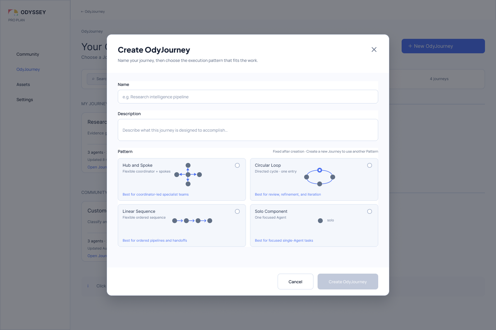
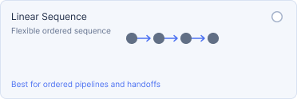
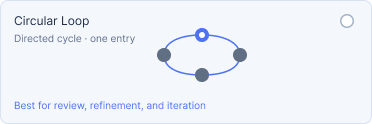

# Relationships Before Roles: Why Odyssey Starts Agent-System Design with Pattern

> Planner, Reviewer, and Worker describe what an Agent is configured to do. Pattern describes how those Agents form a system.

Starting with a list of roles feels natural when designing a multi-Agent system.

We might create a Planner first, add several Workers, and place a Reviewer at the end. Once those names appear, the system seems to have a division of responsibility, and readers can easily imagine how it might work.

But role names often make structural commitments too early.

`Planner` suggests that it comes before other Agents. `Manager` suggests that it holds coordination authority. `Reviewer` suggests that work passes through an inspection stage. Yet do these assumptions belong to the Agent itself, or to the position it occupies in the system? If a Reviewer participates in repeated revision, is it still a one-time check at the end of a pipeline? If a Manager only aggregates information, must it be a special Agent type?

Odyssey therefore does not make predefined roles the first step in system design. When creating an OdyJourney, the designer first selects a System Pattern to establish the basic shape of relationships among Agents, then configures specific Agents into the positions in that structure.

This is what Odyssey means by **relationships before roles**.



*Figure 1: The current design offers four System Patterns: Hub and Spoke, Circular Loop, Linear Sequence, and Solo Component. The number of nodes shown on each card illustrates the relationship shape; it does not define a fixed Slot count. Figma node `417:33`.*

## Pattern Is Not a Set of Role Templates

Pattern does not answer “what should this Agent be called?” It answers:

- which stable collaboration positions exist in the system;
- which relationships are allowed among those positions;
- in what basic direction information or work moves through them; and
- which rules must remain true when positions are added, removed, or reordered.

The same Pattern can therefore support very different role configurations.

A Hub and Spoke system might contain an editor-in-chief with several specialist writers, or a coordinating Agent with several domain experts. Their goals, Prompts, Tools, and Knowledge Spaces may be completely different, but they share one structural judgment: one central position relates directly to several peripheral positions, while those peripheral positions do not need to be forced into a pipeline.

Conversely, an Agent named Reviewer can appear in different Patterns. In a Linear Sequence, it may occupy the final stage. In a Circular Loop, it may be the position that initiates another revision round. In Hub and Spoke, it may be one specialist consulted by the central Agent.

A role name does not uniquely determine a relationship. Odyssey separates the two so that the relationship itself can be discussed and inspected.

## An Agent Slot Is a Position, Not an Agent Type

Pattern expresses stable positions in the structure through Agent Slots.

The three concepts can be understood as follows:

```text
Pattern      defines relationship rules
Agent Slot   is a stable position within those rules
Agent        occupies the position and brings a concrete goal, Workflow, and resources
```

An Agent Slot may be empty or occupied by a specific Agent. Moving an Agent to another Slot changes that Agent’s relational position in the system; it does not automatically turn the Agent into another predefined type.

This distinction also explains why a Slot needs a stable identity within a Pattern. Its meaning should not depend on screen coordinates, display order, or the name of the Agent currently occupying it. Coordinates can be recalculated and the Agent can be replaced, while Pattern Routes continue to refer to the structural position.

## Variable Slots Do Not Mean Free-Form Routing

Figma uses a small number of nodes so that each of the four Patterns can be recognized quickly, but these thumbnails are not fixed-size templates.

Except for Solo Component, the current Patterns allow the number of Slots to change within their respective rules. After a change, the system rebuilds valid relationships according to the Pattern rules instead of allowing designers to add and remove Routes arbitrarily.

This distinction matters:

- **Variable Slots** mean that one relationship principle can accommodate different scales.
- **Free-form routing** means that the designer can change the relationship principle itself.

Odyssey V1 chooses the former. Designers can change the scale of a structure and the Agents occupying it, but they cannot casually add a branch to a Linear Sequence or turn a Circular Loop into a multi-entry convergence graph. A future Custom Pattern can address free-form topology. The value of the current four Patterns is that change occurs within understandable boundaries.

## Four Patterns, Four Relational Judgments

### Solo Component: Collaboration Is Not Always Necessary

```text
[ Slot ]
```


*Figure 2a: Solo Component uses one isolated node to express a fixed single-Agent structure. `solo` is not an Agent name; it emphasizes that the Slot has no internal Route to another Agent Slot. Figma node `419:77`.*

Solo Component always contains one Agent Slot. It has no internal Agent Route and does not allow Slots to be added, removed, or reordered.

It suits work whose goal can be handled independently by one Agent: the scope is clear, collaboration offers limited benefit, or the designer is still validating the Agent’s internal Workflow. Choosing Solo does not mean that the design “has not become multi-Agent yet.” It is an explicit judgment that collaboration would not justify the additional handoff and coordination cost.

It is less suitable when responsibility must be divided, independent review is required, or the work naturally contains several handoff stages. In those cases, placing every responsibility inside one Agent may merely hide system complexity inside a larger Prompt or Workflow.

### Linear Sequence: Stages and Handoffs Have a Clear Order

```text
[ Slot 1 ] → [ Slot 2 ] → [ Slot 3 ] → …
```



*Figure 2b: The Linear Sequence card uses four nodes to illustrate a one-way order. Four is only an example count that makes the relationship shape recognizable; the actual Slot count is variable. Figma node `419:67`.*

Linear Sequence consists of an ordered set of Slots. Designers can add, remove, and reorder Slots. Whenever the order changes, Routes are derived again from the new Slot order.

It suits work in which the output of one stage naturally becomes the input to the next—for example, collection, transformation, inspection, and release preparation performed in sequence. What matters is not whether an Agent is called Researcher or Editor, but whether the work has an explainable stage order and handoff direction.

Linear Sequence becomes strained when work frequently returns to an earlier stage, several specialists contribute around a shared center, or execution order cannot be expressed as a stable sequence. Adding extra edges to patch those cases would gradually undermine the readability of “linear” itself.

### Hub and Spoke: One Center Coordinates Several Independent Directions

```text
            [ Spoke ]
                |
[ Spoke ] — [ Hub ] — [ Spoke ]
                |
            [ Spoke ]
```


*Figure 2c: The Hub and Spoke card emphasizes the direct relationship between one central node and several peripheral nodes. The four Spokes are a topology illustration; the number of Spokes is variable, while the Hub must remain. Figma node `419:39`.*

Hub and Spoke preserves one Hub that cannot be removed, while the number of Spokes can change. The Pattern rules always maintain a direct relationship between the Hub and every Spoke, without forcing the Spokes into an execution sequence.

It suits work in which a central position delegates, aggregates, or coordinates while several peripheral positions contribute distinct expertise. A coordinating Agent might send different questions to several domain Agents and bring their results back to the center. Spokes can be added or removed because the required areas of expertise can change with the scope of the work. The Hub must remain because, without the center, the relationship is no longer Hub and Spoke.

It is less suitable for a pipeline that genuinely depends on strict stage-to-stage handoffs. Nor should the Hub be read as inherently being a Manager Agent type. Hub expresses a central responsibility in the topology; how the Agent occupying it coordinates is still determined by that Agent’s configuration and Workflow.

### Circular Loop: Revision Is Part of the Structure

```text
          [ Slot 2 ]
         ↗          ↘
[ Entry ]             [ Slot 3 ]
         ↖          ↙
          [ Slot 4 ]
```



*Figure 2d: The Circular Loop card uses four nodes to illustrate a one-way closed cycle, with a distinct visual marker for its single entry. Four is an example count; the actual structure requires at least two Slots. Figma node `419:54`; the loop diagram is child node `423:37`.*

Circular Loop contains at least two Slots and allows them to be added, removed, and reordered. It has one explicit entry. All Slots participate in a directed, ordered cycle, and the final Slot routes back to the entry. It has no built-in branching, parallel paths, or convergence semantics.

It suits work that requires repeated review, revision, and gradual refinement. When one output naturally triggers another round of inspection and adjustment, iteration is not an exception drawn onto the flowchart; it is part of the collaboration relationship itself.

Circular Loop specifies only “where work goes next.” It does not automatically answer “when should it stop?” Maximum rounds, exit conditions, human confirmation, and other execution policies belong to Execution Behavior and future runtime mechanisms. Connecting nodes into a cycle cannot replace a termination policy.

It is also less suitable for a one-pass ordered delivery or complex routing with branches and convergence. For stored-data compatibility, the internal persisted key may remain `diamond_loop`. Odyssey uses **Circular Loop** in reader- and designer-facing language because it describes the current semantics more accurately.

## Side by Side: What Is Fixed, and What May Change

| Pattern | Slot scale | Relationship that must remain | Better suited to | Not suited to |
| --- | --- | --- | --- | --- |
| **Solo Component** | Fixed at 1 | One isolated position with no internal Agent Route | Focused single-Agent work; validating a local Workflow | Work that must divide responsibility or include independent review |
| **Linear Sequence** | Variable | A one-way ordered sequence; Routes are derived from order | Staged processing and explicit handoffs | Central coordination, frequent iteration, or branch-and-merge routing |
| **Hub and Spoke** | One fixed Hub plus variable Spokes | Every Spoke maintains a direct relationship with the Hub | A coordinator with several specialist directions | A strict sequential pipeline |
| **Circular Loop** | Variable, minimum 2 | One entry, one directed cycle, and a final Slot that returns to the entry | Review, revision, and iteration | A one-pass pipeline or branch-and-merge routing |

“Better suited to” indicates a structural fit in the design; it is not a Benchmark result. Odyssey does not currently claim that a particular Pattern necessarily delivers higher accuracy, lower cost, or greater speed for a class of tasks. Pattern first helps designers make their assumptions explicit. Results still need to be tested within a concrete task, Agent configuration, and runtime context.

## Why Pattern Is Selected When an OdyJourney Is Created

The current design selects a Pattern when the OdyJourney is created and treats it as a stable structural identity afterward. To use a different Pattern, the designer creates a new OdyJourney rather than switching Pattern inside the existing Journey as if it were a theme or layout option.

The reason is that changing Pattern is not merely rearranging nodes.

Changing Linear Sequence into Hub and Spoke requires deciding which Slot becomes the Hub. Changing Hub and Spoke into Circular Loop requires deciding the single entry and the order around the cycle. Changing Circular Loop into Solo Component requires deciding what happens to the other Agents, Workflows, and resource configurations. Automatic conversion may appear convenient, but it can make the most important architectural decisions on behalf of the designer—or silently discard the meaning of existing relationships.

Odyssey therefore allows constrained changes within a Pattern—adding Slots, removing Slots, reordering them where supported, and replacing the Agents occupying them—but does not pretend that conversion between Patterns is lossless.

This is a deliberate limitation. It trades the convenience of switching topology at any time for protection against silently rewriting Pattern identity, Slot semantics, and system structure.

## This Design Moves the Discussion from Names Back to Assumptions

When roles are no longer the starting point, designers can first discuss more fundamental questions:

- Is the work completed once, or repeatedly revised?
- Do its stages genuinely have a stable order?
- Does one central position need to carry coordination responsibility?
- When another Agent is added, does it extend an area of expertise, add a processing stage, or lengthen a cycle?
- Which relationships must be maintained by the system rather than implied by Agent names?

These questions do not configure the Agents for the designer, but they ground configuration in a set of visible structural assumptions. Names such as Planner, Reviewer, or Specialist remain useful afterward; they simply no longer define topology implicitly.

Pattern can therefore become a form of communicable design knowledge. A team can compare “why does this work need central coordination?” or “why should revision form a closed cycle?” without first arguing about whether an Agent ought to be called Manager.

## Costs and Open Questions

Relationships before roles does not mean roles are unimportant, nor does it mean that four Patterns can express every system.

First, designers must make a structural judgment when an OdyJourney is created. That can feel premature when the work itself is not yet understood. The creation interface must support the decision with sufficiently clear topology, use cases, and limitations rather than presenting only four attractive icons.

Second, variable Slots introduce new readability problems. A Hub and Spoke with three Spokes is easy to recognize; will one with more than a dozen remain clear? How does a Circular Loop keep its entry and direction visible as the number of Slots grows? These questions still need to be tested in Pattern layout and interaction design.

Finally, the four built-in Patterns intentionally exclude free branching, convergence, and arbitrary Routes. This boundary preserves the explainability of the current design, but it also means that some complex collaborations cannot yet be expressed directly. If a future Custom Pattern opens the structure, Odyssey will need to revisit validation, layout, migration, and sharing rather than merely adding a “free-form routing” switch.

## Terms Used in This Article

| Term | Meaning in this article |
| --- | --- |
| **OdyJourney** | A system-level design object composed of a System Pattern, Agents, resources, and execution rules. |
| **System Pattern** | A system-level structure that defines relationship invariants among Agent Slots. Shortened to Pattern in this article. |
| **Agent Slot** | A structural position with a stable identity in a Pattern; it may be empty or occupied by one Agent. |
| **Agent** | A concrete configured object that occupies a Slot and has its own goal, Workflow, Tools, and Knowledge Space references. |
| **Route** | A relationship among Slots maintained by Pattern rules; it is not a control-flow edge inside an Agent Workflow. |
| **Circular Loop** | A directed, ordered cycle with one entry. Its internal compatibility key may remain `diamond_loop`. |

## Design Sources

- Current Pattern selection: [Figma `OdyJourney — Create Journey Modal` (`417:33`)](https://www.figma.com/design/P3EF9io2DhyhwkNYBVqB5Z/Odyssey-Design?node-id=417-33);
- Current Pattern cards: Figma `419:39` (Hub and Spoke), `419:54` (Circular Loop), `419:67` (Linear Sequence), and `419:77` (Solo Component), exported on 2026-10-07;
- Pattern and Agent Slot constraints: `odyssey/doc/architecture/domain/odyssey-v1-design-constraints.md`;
- Circular Loop decision: `odyssey/doc/architecture/domain/diamond-loop-pattern-decision.md`;
- OdyJourney system structure: `odyssey/doc/product/OdyJourney.md`;
- Pattern’s role in the two-level Canvas structure: the sample chapter “Why Two Canvas Levels.”
