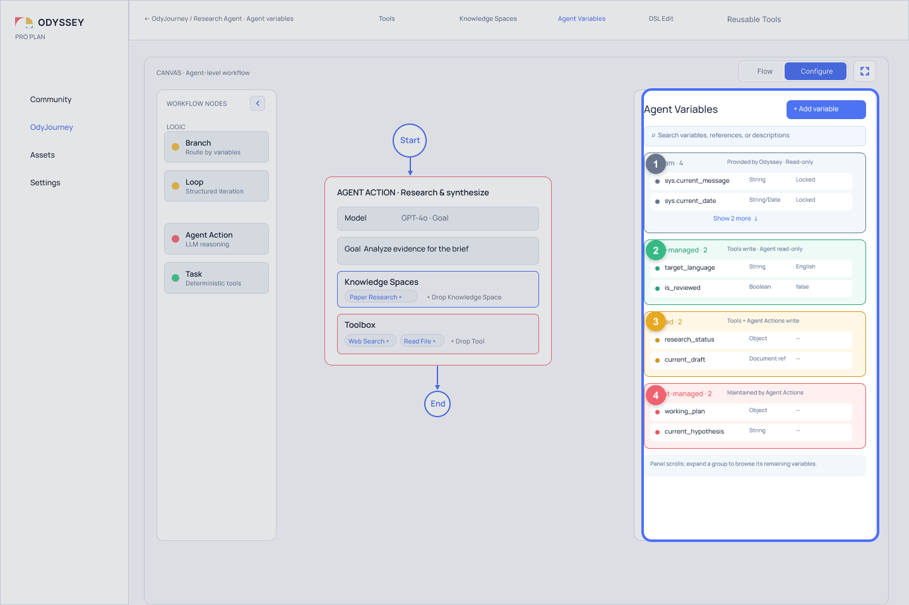
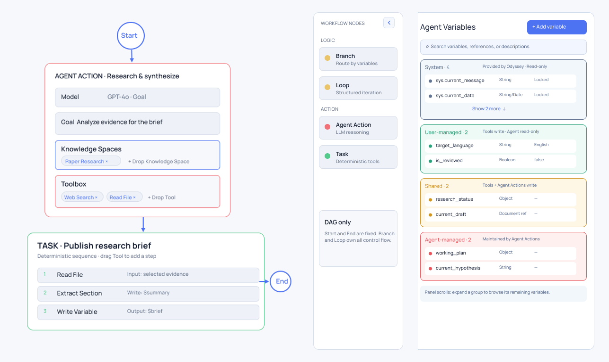
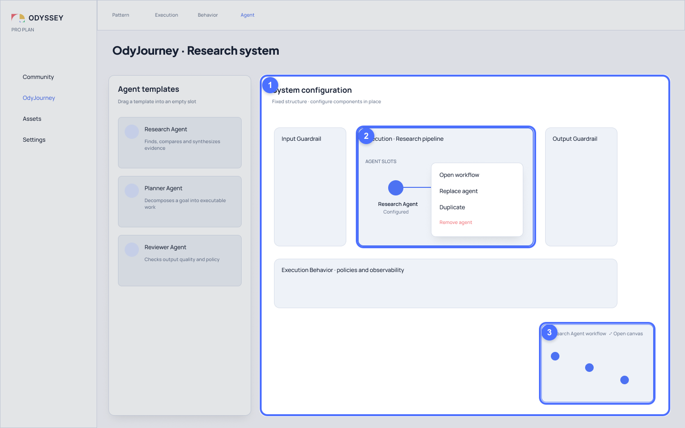
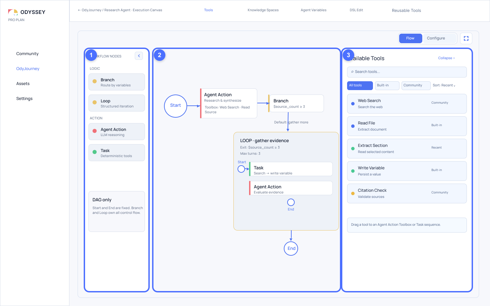
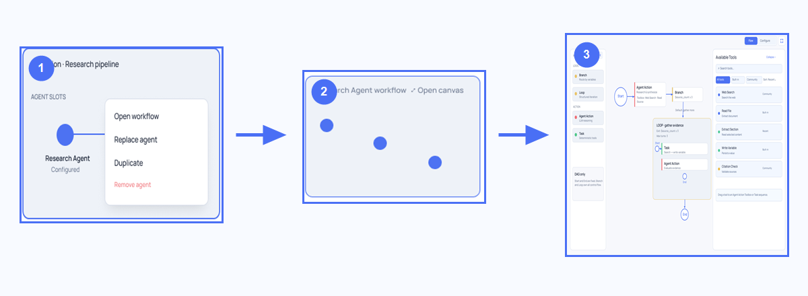

# Why Two Canvas Levels?

> Put “how multiple Agents collaborate” and “how one Agent works” at different design scales.

An infinite Canvas may seem like the most natural starting point for designing an Agent system: there is always room for more nodes and more connections. Put every object on the same surface, and the system appears to become visible.

But space is not structure.

When we try to represent both the collaboration within an OdyJourney and the internal workings of each Agent, a single Canvas must answer two fundamentally different questions:

- What collaboration positions does the system need, and how do they relate to one another?
- Once an Agent receives work, what steps, branches, loops, and tool calls does it go through?

The first question concerns system topology; the second concerns local execution. They involve different objects, scales, and editing rhythms. If they are forced onto the same plane, the Canvas may remain “infinite,” but the reader’s attention does not.

This is why Odyssey uses two Canvas levels.

## Why One Canvas Gradually Breaks Down

Expanding the whole system and every Agent’s internal Workflow on one Canvas creates a concrete conflict of scale.

When the view is zoomed out far enough to understand collaboration among multiple Agents, the Tasks, Branches, and Loops inside each Agent become illegible details. When the view is zoomed in far enough to edit one Agent’s nodes, the other Agents—and that Agent’s position in the system—leave the viewport.

This is more than an inconvenient zoom experience. The deeper problem is that two structures are forced to share one visual grammar:

- Is an Agent a collaborator in the system, or a node in a Workflow?
- Does an edge represent collaboration between Agents, or control flow inside one Agent?
- Should a Tool or Knowledge Space appear in the system topology, or only in a particular Agent’s Workflow?
- When the user moves an object, are they changing system semantics or only a local layout?

## From a Workflow Builder to an Agent System Builder

The problem is not simply that “the Canvas has too many nodes.” When a visual AI builder treats the Workflow as its basic unit of editing, nodes can represent model calls, conditions, tools, or data processing, while edges represent execution order. This language is direct and effective for designing a process.

But once a product begins to represent multiple Agents, the existing visual grammar encounters a new problem: collaboration among Agents is not the same kind of relationship as the execution steps inside one Agent.

If both continue to use the same nodes and edges, system-level structure is easily compressed into “more Workflow nodes.” An Agent can then be mistaken for one step in a process rather than a subject with its own goal, state, resources, and internal Workflow.

Odyssey did not introduce two Canvas levels because a conventional Workflow Canvas lacks value. On the contrary, the Agent Workflow Canvas preserves the strengths of Workflow notation for expressing control flow. Odyssey adds the Journey Canvas because the layer above the Workflow needs a different visual scale—one that can show how multiple Agents form a system.

## Color Answers Responsibility; Levels Answer Scale

Before explaining the two Canvas levels, we need to introduce another foundational idea in Odyssey: Thinking Ownership.

Thinking Ownership asks who is responsible for making a decision. Odyssey uses three colors to distinguish three kinds of responsibility:

- Green means **User-managed**: the decision is configured by the user in advance.
- Yellow means **Shared**: the state can be maintained jointly by user-designed structure and an Agent.
- Red or pink means **Agent-managed**: the Agent makes an open-ended judgment within explicit boundaries.

State provided and maintained by the System uses neutral gray and is not one of the three assignable Thinking Ownership categories.

This color language runs throughout Odyssey. It can appear as spatial regions, Workflow nodes, variable groups, text labels, or resource permissions. Color tells readers “who is responsible,” but it cannot answer a different question: at what system scale should that responsibility be viewed and edited?

When collaboration among multiple Agents and the internal Workflow of every Agent are laid out on the same Canvas, system topology and local control flow still compete for space and visual grammar—even if every object is clearly colored.

The three-color Thinking Ownership system and the two Canvas levels are therefore not successive alternatives:

- Thinking Ownership separates responsibilities.
- The two Canvas levels separate design scales.

Odyssey needs both.



*Figure 1a: The current expression of Thinking Ownership in Agent Variables. ① Read-only state provided by the System; ② User-managed in green; ③ Shared in yellow; ④ Agent-managed in red or pink. Figma node `119:2`, exported on 2026-10-02 and annotated on 2026-10-03.*

This figure also shows that Thinking Ownership does not depend on a single fixed three-color region. The same language of responsibility can appear in Workflow nodes, variable groups, and resource permissions. It identifies responsibility, not the design scale of the Canvas.



*Figure 1b: The same Thinking Ownership colors across different interface objects. In the Configure view of Focus Mode on the left, open-ended Agent Actions use red or pink, while deterministic Tasks use green. The Node Palette in the center continues to distinguish Branch / Loop, Agent Action, and Task with yellow, red or pink, and green. Agent Variables on the right use the same colors to organize Shared, Agent-managed, and User-managed state. Composed from Figma nodes `166:2`, `62:2`, and `119:2`; exported and assembled on 2026-10-03.*

This consistency matters more than any particular layout. Color is not a decorative classification for node types. It allows readers to move among nodes, variables, and resource boundaries while still recognizing who primarily maintains a decision. Objects can change; the language of responsibility remains stable.

## Level One: The Journey Canvas Defines System Collaboration

The Journey Canvas answers this question: what collaboration structure makes up this OdyJourney?

In the current design, the system-level Canvas in the Journey Editor—currently labeled `System Canvas` in the UI—organizes execution structure along two dimensions. Horizontally, the execution chain consists of Input Guardrail, Main Execution, and Output Guardrail. The vertical dimension is expressed by Execution Behavior (currently `Behavior` in the UI), which spans the full execution chain in the second row of the Canvas. Main Execution uses the System Pattern selected by the designer for the OdyJourney, while the two Guardrails use the System’s fixed `Single` Pattern.

Each Pattern provides stable collaboration positions through Agent Slots. An Agent Slot is the position an Agent occupies in a Pattern: it carries a particular relational responsibility and can be occupied by a specific Agent. The Journey Canvas is concerned with where an Agent sits in a structure and how that position relates to others—not with immediately expanding every step inside that Agent.

This restraint keeps the Journey Canvas at the system scale. Readers can first inspect:

- which collaboration Pattern the system uses;
- which Agent Slots the Pattern provides;
- which Slots have configured Agents;
- how Input Guardrail, Main Execution, and Output Guardrail form the horizontal execution chain;
- how Execution Behavior cuts across the full execution chain; and
- where to enter the local design of an Agent.

It presents visible and editable system structure—not the model’s private internal reasoning.



*Figure 2: The system-level view of the Journey Canvas. ① The first row of System configuration contains Input Guardrail, Main Execution, and Output Guardrail; Execution Behavior spans all three in the second row. ② Research Agent occupies an Agent Slot in the Main Execution Pattern. ③ The read-only Workflow Preview in the lower-right corner provides a local preview before entering the Agent Workflow. Figma node `59:2`, exported on 2026-10-02 and annotated on 2026-10-03.*

### Pattern Defines the Shape of Relationships First

The Journey Canvas does not begin with a set of predefined Agent roles. When creating an OdyJourney, the designer first chooses a System Pattern to establish the basic shape of collaboration, then configures specific Agents into the positions provided by that Pattern.

The current design presents four simplified starting points: Hub and Spoke, Circular Loop, Linear Sequence, and Solo Component. They describe relationship structures—coordination, iteration, sequence, or a single component—before prescribing role names such as Planner, Reviewer, or Worker.


*Figure 3: Selecting a System Pattern when creating an OdyJourney. Each option first expresses the shape of the relationship as a minimal topology, then offers a short indication of the work it suits. Figma node `417:33`, exported on 2026-10-03.*

A Pattern is not an expanded Agent Workflow. It determines which positions exist at the system level and how they relate; the Agent in each position can still have its own Goal, resources, and internal Workflow. This article introduces only the role Pattern plays in the two-level structure. A separate chapter will explain why Pattern emphasizes relationships rather than roles.

## Level Two: The Agent Workflow Canvas Defines How One Agent Works

Once we enter a specific Agent, the question changes.

The reader is no longer comparing collaboration positions among multiple Agents. They are designing how this Agent completes its work: where it begins, when it performs an Agent Action, which steps form a Task, where it branches, which conditions require a Loop, and how Tools, Knowledge Spaces, and Agent Variables enter those steps.

The Agent Workflow Canvas therefore has its own node language and editing space. It belongs to one specific Agent, not to the entire OdyJourney. Edges here express control relationships inside the Workflow; they do not compete with collaboration relationships at the Journey level.

Once separated, both levels can remain clear. The Journey Canvas does not need to carry every node-level detail, and the Agent Workflow Canvas does not need to repeat the entire system topology.



*Figure 4: The Workflow Canvas after entering Research Agent. ① Node Palette; ② the Agent’s internal control flow; ③ Available Tools. All three areas are organized around one Agent. The edges here represent execution relationships inside the Agent, not collaboration relationships among Agents in the Journey. Figma node `62:2`, exported on 2026-10-02 and annotated on 2026-10-03.*

## A Link Alone Cannot Connect the Two Levels

Separating the levels resolves the visual-scale problem, but introduces another risk: if selecting an Agent immediately opens a new page, users can easily lose the position they just occupied in the system.

Odyssey uses a three-step progressive transition to soften this change of scale:

```text
Agent Slot
→ Read-only Workflow Preview
→ Full Agent Workflow Canvas
```



*Figure 5: The progressive transition across the two Canvas levels. ① Select a configured Agent Slot on the Journey Canvas. ② Inspect a read-only Workflow Preview without leaving the system view. ③ Enter the full Agent Workflow Canvas when deeper editing is needed. Composed from Figma nodes `59:2` and `62:2` on 2026-10-04.*

When a configured Agent Slot is selected, the Journey Canvas remains in place while a read-only Workflow Preview appears in the lower-right corner. The Preview does not support node configuration. It shows just enough Workflow topology to confirm how the Agent in that Slot works.

Only when users choose to edit in depth do they enter the full Agent Workflow Canvas through Open canvas / fullscreen.

The Preview is not a miniature editor. It is a wayfinding cue between the two levels: it neither pushes all the detail back into the Journey Canvas nor forces users to leave the system view without warning.

Figure 5 expands this transition explicitly. The Agent Slot occupied by Research Agent and its read-only Workflow Preview both come from the Journey Canvas shown in Figure 2; the final step enters the full Agent Workflow Canvas shown in Figure 4. This allows users to retain the Agent’s position in the system before entering local editing.

## What This Decision Makes Understandable

The first benefit of two Canvas levels is not more functionality, but a more stable reading order.

Readers can first understand the system structure at the Journey level, then select an Agent and enter its Workflow. After making changes, they can return to the Journey level to inspect its position in the larger collaboration. System relationships and local control flow no longer use the same edge, and resources do not have to be repeated at every scale.

This separation also establishes clear editing boundaries:

- Changing a Pattern or Agent Slot on the Journey Canvas changes the system’s collaboration structure.
- Changing nodes and edges on the Agent Workflow Canvas changes the internal working structure of one Agent.
- The Preview supports observation and orientation; it does not introduce a third editing language.

This makes the design inspectable. People can discuss trade-offs around explicit objects without first having to explain which zoom level they are looking at.

## What It Does Not Make Visible

The two Canvas levels expose design-time structure: objects, relationships, control boundaries, resource entry points, and editable decision positions.

They do not reveal the model’s entire runtime thought process, nor do they imply that Odyssey can read or display a model’s private Chain of Thought. Even if runtime records are introduced in the future, they belong to a separate problem of runtime traceability and cannot be inferred from the structural visibility of a Canvas.

This distinction matters. Otherwise, “drawing the Agent system” can easily be misrepresented as “showing everything the Agent thinks.” The former is an Odyssey design goal; the latter is not.

## The Cost of Two Canvas Levels

Separation does not provide clarity for free.

Users must navigate between the Journey and Agent Workflow levels while preserving context across both scales. If the Preview is too simple, it loses its value for recognition; if it supports too many operations, it becomes a second editor embedded in the Journey. After users enter the Full Canvas, the page must continue to show which Agent in which Journey they are editing—and how to return to the original system position.

The quality of the two-level Canvas therefore depends on the connection between the two levels, not only on how polished each Canvas looks in isolation. Agent Slot selection feedback, Preview information density, the Open canvas entry point, and the return path together determine whether the shift in abstraction feels natural.

This is the trade-off we accept: one explicit navigation step in exchange for keeping two structures from contaminating each other.

## Questions That Remain Open

The current design establishes the basic responsibilities of the two levels, but several questions still require observation:

- How much node information should the Preview preserve to support recognition without inviting editing?
- Which selection and viewport context should be restored when users return to the Journey Canvas?
- How can a miniature topology remain legible when an Agent Workflow becomes large?
- Which cross-level information should remain visible, and which should appear only after entering an Agent?
- Does the two-level structure need stronger breadcrumbs or hierarchy cues?

These questions do not overturn the core rationale for two Canvas levels, but they will determine whether the design actually reduces the cost of understanding.

## Terms Used in This Article

| Term | Meaning in this article |
| --- | --- |
| **OdyJourney** | A system-level design object composed of a System Pattern, Agents, resources, and execution rules. |
| **Journey Canvas** | The system-level design surface of an OdyJourney; currently labeled `System Canvas` in the UI. |
| **System Pattern** | The structure that defines the shape of system collaboration and its Agent Slots. |
| **Agent Slot** | The stable position an Agent occupies in a Pattern; domain-model and data materials may also call it a `Pattern Slot`. |
| **Agent Workflow Canvas** | A local editing surface that belongs to one specific Agent and is used to design its internal Workflow. |
| **Workflow Preview** | A read-only miniature view shown after selecting a configured Agent Slot; it preserves Journey context and provides an entry point to the full Workflow. |
| **Thinking Ownership** | A design language that uses green, yellow, and red or pink for User-managed, Shared, and Agent-managed responsibilities; System state uses neutral gray. |
| **Execution Behavior** | The rules, policies, and observability structure that cut across the full Input Guardrail, Main Execution, and Output Guardrail chain; currently shortened to `Behavior` in the UI. |

## Design Sources

- Current design: [Figma `OdyJourney — Resource Library Open` (`59:2`)](https://www.figma.com/design/P3EF9io2DhyhwkNYBVqB5Z/Odyssey-Design?node-id=59-2), verified on 2026-09-21;
- Current design: [Figma `Research Agent — Workflow Canvas` (`62:2`)](https://www.figma.com/design/P3EF9io2DhyhwkNYBVqB5Z/Odyssey-Design?node-id=62-2);
- Current Thinking Ownership design: [Figma `Agent Workflow Canvas — Agent Variables` (`119:2`)](https://www.figma.com/design/P3EF9io2DhyhwkNYBVqB5Z/Odyssey-Design?node-id=119-2), verified on 2026-10-02;
- Current Focus Mode design: [Figma `Agent Workflow Canvas — Focus Mode` (`166:2`)](https://www.figma.com/design/P3EF9io2DhyhwkNYBVqB5Z/Odyssey-Design?node-id=166-2), verified on 2026-10-03;
- Current Pattern selection design: [Figma `OdyJourney — Create Journey Modal` (`417:33`)](https://www.figma.com/design/P3EF9io2DhyhwkNYBVqB5Z/Odyssey-Design?node-id=417-33), verified on 2026-10-03;
- Current information architecture: `odyssey/doc/product/information-architecture/odyssey-figma-information-architecture.md`;
- System Configuration structure: `odyssey/doc/product/OdyJourney.md`, `odyssey/doc/planning/implementation/frontend/system-configuration-grid-behavior-boundary-implementation-plan.md`;
- Terminology and language guidance: `doc/foundations/first-release-terminology.md`, `doc/foundations/visibility-language-guidelines.md`.
