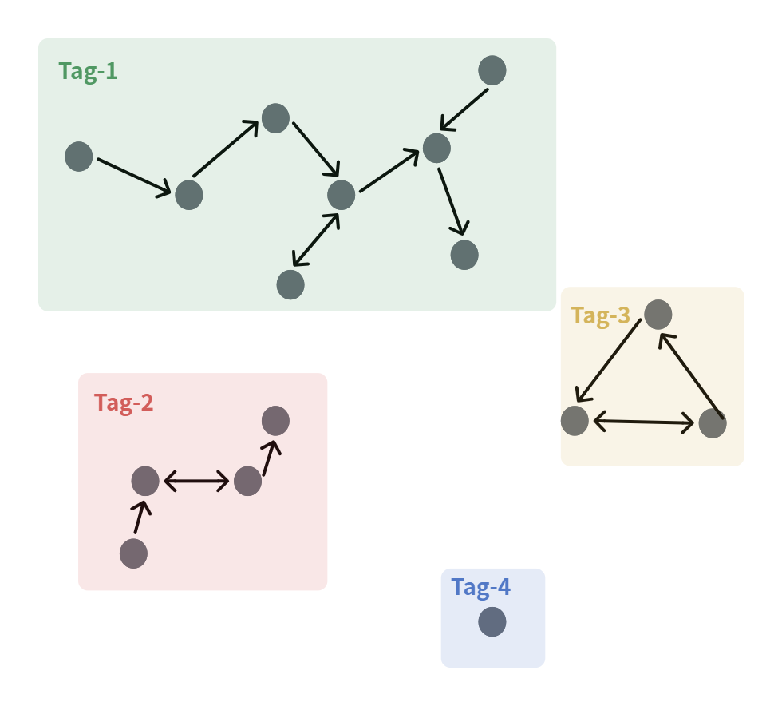
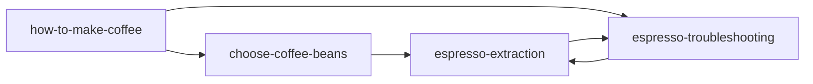
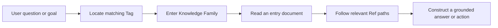

# Knowledge Space

## Motivation
Traditional knowledge bases are essentially document repositories.

```text
Knowledge Base
├── design/
├── prompts/
├── api/
└── docs/
```

Although this organization is intuitive for humans, it does not reflect how knowledge is actually connected.

Retrieval-Augmented Generation (RAG) can find relevant information, but its result is often a set of isolated fragments. A language model can see individual facts without seeing how those facts relate to one another or where they belong in the whole body of knowledge.

Reasoning needs more than relevant fragments. It needs a global view of the knowledge domain and explicit paths through that domain. Odyssey introduces **Knowledge Space** to provide that view: documents are connected through references, and their relationships become available for both human and LLM navigation.

Retrieval is therefore an entry point, not the end of the process. After entering a Knowledge Space, an LLM can follow the document graph to gather the context required for a grounded decision or action.

## What It Is

A **Knowledge Space** is a collection of documents organized as a global, directed knowledge graph.

Each document is a node. Each item in a document's `Ref` section is a directed edge to another document. The graph may contain multiple disconnected areas and may contain cycles.

Folders are only a storage convention. They do not define the knowledge structure; document references do.



## Design Principles

### Graph Over Folders

Traditional agent knowledge bases, prompts, and specifications are usually organized by folders. Odyssey re-manages every document in a selected directory as part of one Knowledge Space. Its actual organization is derived from document references rather than physical placement.

### Global Context Over Isolated Retrieval

Semantic search may identify a relevant document, but it cannot by itself explain the document's role in a larger topic. Knowledge Space exposes the surrounding graph so an LLM can move from a local result to the related knowledge needed for reasoning.

### One Document Model

Odyssey does not separate knowledge-base documents, prompt files, design documents, specifications, instruction files, or notes. Each is a document node governed by the same metadata contract and connected through explicit references.

### Explicit Reasoning Scaffold

Knowledge Space is a reasoning scaffold for LLMs such as Claude Code. It guides how a model expands context instead of leaving it to reason freely across unrelated files. The resulting paths, evidence, and boundaries are easier for people to inspect and verify.

## Document Contract

Every document in a Knowledge Space **must begin** with the following metadata block. The body follows it.

```md
Tag: coffee
Ref:
- For how to make a coffee see: /knowledge-space/coffee/how-to-make-coffee.md
- For how to choose beans for a target flavor see: /knowledge-space/coffee/choose-coffee-beans.md

Summary: A concise description of this document's subject and boundaries, in 300 words or fewer.

Guide: A short reading guide that states when to start here, what the reader will achieve, and which references to follow next for related questions.
```

### Tag

`Tag` identifies the Knowledge Family to which the document belongs. Documents in the same family share at least one tag. Use stable, normalized identifiers such as `coffee`, `payments`, or `api-design`.

Tags are not loose labels for filtering individual files. They are semantic entry points into a coherent area of the graph.

### Ref

`Ref` lists this document's outgoing navigation paths. Each entry must describe both the question it answers and the target document. Use a repository-relative path so the reference remains unambiguous and machine-readable.

References may point forward, backward, or form cycles. A document may have no references when it is an intentionally isolated node.

### Summary

`Summary` is a factual scope statement of 300 words or fewer. It tells a reader or model what the document covers and, when useful, what it deliberately does not cover.

### Guide

`Guide` is a navigation instruction, not a second summary. It tells a reader when this document is the right starting point, what to do with its content, and where to go next.

## Worked Example: Coffee Knowledge Family

The following four documents form one `coffee` Knowledge Family. Together they support a practical task without turning one file into an encyclopedia.



### Entry Document: `how-to-make-coffee.md`

```md
Tag: coffee
Ref:
- For how to choose beans for a target flavor see: /knowledge-space/coffee/choose-coffee-beans.md
- For how to troubleshoot sour, bitter, or fast-pouring espresso see: /knowledge-space/coffee/espresso-troubleshooting.md

Summary: This document gives the standard workflow for making a hot coffee: choose a coffee-to-water ratio, grind the beans, prepare an espresso or brewed coffee base, and add water or milk as desired. It explains the purpose and success condition of each step. It does not provide a catalog of bean origins or a detailed diagnosis of extraction defects.

Guide: Start here when the question is "How do I make a coffee?" Follow the workflow in order. If you have not selected beans, follow the first reference before grinding. If the espresso tastes sharply sour, harshly bitter, or runs at an unexpected speed, follow the troubleshooting reference rather than changing several variables at once.

# How to Make a Coffee
...
```

This file is the operational entry point. Its references route the reader to a decision before brewing and to a recovery path after a failed result.

### Supporting Documents

| Document | Responsibility | Example navigation path |
| --- | --- | --- |
| `choose-coffee-beans.md` | Matches roast, origin, and processing style to a desired flavor. | Links to extraction when the chosen roast changes the target recipe. |
| `espresso-extraction.md` | Explains dose, yield, time, grind size, and how they affect flavor. | Links to troubleshooting when measured results differ from the target. |
| `espresso-troubleshooting.md` | Diagnoses sour, bitter, weak, fast, and slow shots through controlled adjustments. | Links back to extraction for the underlying variables and target ranges. |

The back-reference from troubleshooting to extraction is intentional: it represents a real reasoning loop, not an error in the graph.

## Knowledge Families and the Global Graph

A **Knowledge Family** is a strongly related region of documents identified by one or more shared tags. `coffee` is one family; `payments` might be another. A Knowledge Space contains the complete topology of all families, including isolated documents and cross-family references.

```text
Knowledge Space
|-- Global directed knowledge graph
|   |-- Knowledge Family: coffee
|   |-- Knowledge Family: payments
|   `-- Isolated document: glossary
`-- Physical folders (storage only)
```

Every Knowledge Family must share at least one Tag as its semantic identifier. Tags may be generated by an LLM, maintained manually by users, or supplied and overridden by an `odyssey-system` extension. The generation strategy may vary, but the shared semantic identifier is required.

The graph is the source of organizational truth. Moving a file does not change its place in the knowledge model if its references are updated to preserve the same edges.

## Navigation

When a user gives a goal, an agent navigates rather than merely collecting similar fragments:



For example, "Why is my espresso sour?" enters the `coffee` family, starts at `espresso-troubleshooting.md`, and follows its reference to `espresso-extraction.md` only when the underlying parameter guidance is needed.

## Agent Configuration

Knowledge Space simplifies the configuration of an Agent Node in the canvas. Instead of asking users to fill in a large collection of configuration forms for prompts, knowledge bases, retrieval strategies, memory, prompt templates, and tools, the essential input is:

```text
Knowledge Space
+
Goal
```

The LLM determines how to interact with the user and how to navigate the selected Knowledge Space in pursuit of the goal. This document defines the knowledge and navigation model; the next Agent Node document describes the node itself.

### Knowledge-Only Mode

Knowledge-Only Mode is an optional switch that requires every LLM decision and generated action to be grounded exclusively in the selected Knowledge Space. It establishes a clear reasoning boundary and makes the basis of an answer easier to inspect.

## Backend Responsibilities

The backend maintains the global graph independently of the physical file tree. Its responsibilities are:

- Parse and validate the required metadata block in every document.
- Resolve and index `Ref` targets.
- Build and update the directed graph after document changes.
- Detect or maintain Knowledge Families through shared tags and topology.
- Generate Tags through an LLM when configured, and accept user- or extension-provided Tags.
- Provide paths that allow an agent or user to inspect how a conclusion was reached.

Odyssey therefore turns a passive collection of files into an active reasoning framework: a structured Knowledge Space that guides an LLM through explicit, inspectable knowledge relationships.
