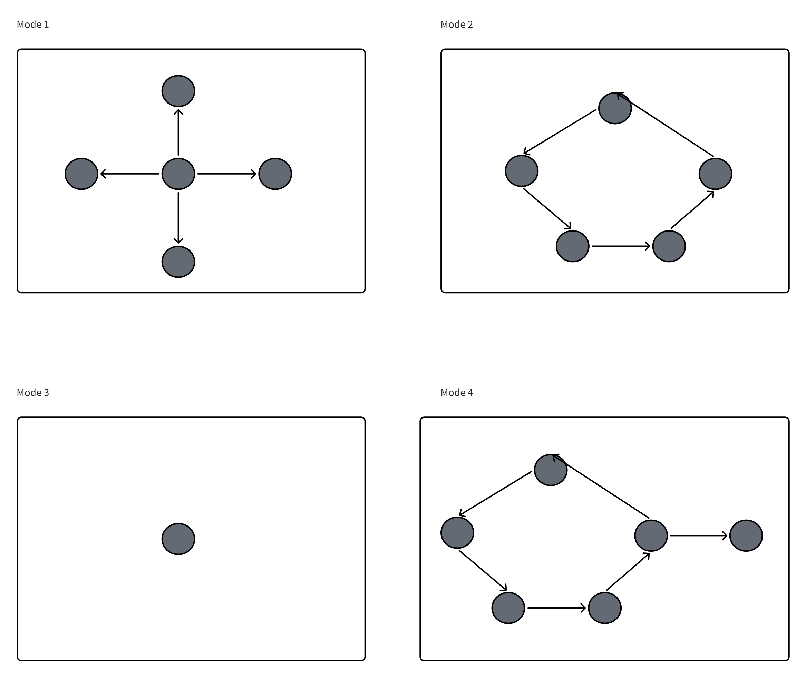

# Pattern

## Overview

In many existing AI agent platforms, multi-agent systems are explicitly organized around a **role-based hierarchy**.

A common design is the distinction between a **Main Agent** and multiple **Sub Agents**, where the Main Agent acts as a central coordinator that decomposes tasks and delegates execution.

However, this represents only one possible collaboration strategy.

Odyssey abstracts agent collaboration into a first-class concept: **Pattern**.

A Pattern does not define what an agent is. Instead, it defines **how agents are organized and connected**.

Rather than assigning predefined roles such as:

-   Manager Agent
-   Worker Agent
-   Research Agent

Odyssey treats every agent as a fundamental building block. The behavior of a multi-agent system emerges from:

-   the collaboration structure,
-   information flow,
-   execution dependency,
-   and communication topology.

A Pattern is therefore an **abstract graph schema that describes a family of possible agent collaboration structures**.

A concrete agent system is a realization of a Pattern.

------------------------------------------------------------------------

# Formal Definition

A Pattern is not a single fixed graph instance. Instead, it defines a class of graph structures.

A Pattern can be represented as:

\[ P=(G_s,\phi,C) \]

where:

-   $G_s$ represents the abstract structural graph.
-   $\phi$ represents the abstraction mapping from concrete systems to the abstract structure.
-   $C$ represents structural constraints.

The abstract graph:

\[ G_s=(V_s,E_s) \]

describes:

-   abstract agent positions,
-   abstract communication relationships,
-   allowed structural variations.

A concrete agent system is represented as:

\[ G_i=(V_i,E_i) \]

where:

-   $V_i$ represents concrete agent instances.
-   $E_i$ represents concrete communication or execution dependencies.

A concrete system conforms to a Pattern if:

\[ \phi(G_i)\cong G_s \]

where:

-   $\phi(G_i)$ is the abstracted representation of the concrete system.
-   $\cong$ represents graph isomorphism.

In other words:

1.  A concrete system is first mapped into its abstract collaboration structure.
2.  The abstracted structure is then compared with the Pattern schema.
3.  Systems with different implementations can still belong to the same Pattern if they share the same abstract organization.

------------------------------------------------------------------------

# Pattern Instantiation

Instantiation describes the process of creating a concrete agent system from a Pattern.

A Pattern defines structural rules, while instantiation provides concrete implementations.

Formally:

\[ S_i=Inst(P,C_i) \]

where:

-   $P$ is the Pattern.
-   $C_i$ is the concrete configuration.
-   $S_i$ is the instantiated agent system.

The configuration may include:

-   agent capability,
-   model selection,
-   prompts,
-   tools,
-   knowledge resources,
-   execution constraints.

For example:

A Hub Pattern:

```Mermaid
flowchart TD
    C[Coordinator]
    W1[Worker]
    W2[Worker]
    W3[Worker]

    C --> W1
    C --> W2
    C --> W3
```

can be instantiated as:

```Mermaid
flowchart TD
    P[Research Planner]

    L[Literature Agent]
    D[Data Agent]
    S[Summary Agent]

    P --> L
    P --> D
    P --> S
```

or:

```Mermaid
flowchart TD
    P[Project Manager]

    C[Coding Agent]
    T[Testing Agent]
    D[Documentation Agent]

    P --> C
    P --> T
    P --> D
```

Although these systems have different purposes and agent implementations, they conform to the same Pattern because their abstract collaboration structure is equivalent.

------------------------------------------------------------------------

# Structural Equivalence Under Abstraction

Traditional graph isomorphism compares two concrete graphs directly.

However, Pattern equivalence operates at a higher abstraction level.

Two concrete agent systems may have:

-   different numbers of agents,
-   different agent names,
-   different capabilities,
-   different intermediate nodes,

while still belonging to the same Pattern.

The equivalence is determined after applying an abstraction function:

\[ \phi:G_i\rightarrow G_s \]

Two systems are Pattern-equivalent if:

\[ \phi(G_1)\cong\phi(G_2) \]

This means:

-   The concrete implementations may differ.
-   The graph instances may not be identical.
-   Their abstract collaboration principles are the same.

------------------------------------------------------------------------

# Pattern Examples

The following examples represent different Pattern instances.



## Mode 1: Hub Pattern

Abstract structure:

```Mermaid
flowchart TD
    C[Coordinator]
    W1[Worker]
    W2[Worker]
    W3[Worker]

    C --> W1
    C --> W2
    C --> W3
```


Characteristics:

-   One coordination point.
-   Multiple execution units.
-   Supports parallel task delegation.

Typical applications:

-   Task planning.
-   Multi-agent execution.
-   Parallel problem solving.

------------------------------------------------------------------------

## Mode 2: Pipeline Pattern

Abstract structure:

```Mermaid
flowchart LR
    A[Agent A] --> B[Agent B]
    B --> C[Agent C]
```

Characteristics:

-   Sequential transformation.
-   Each agent performs a specialized stage.
-   Information flows linearly.

Typical applications:

-   Content generation.
-   Data processing.
-   Multi-stage reasoning.

------------------------------------------------------------------------

## Mode 3: Single Agent Pattern

Abstract structure:

```Mermaid
flowchart TD
    A[Agent]
```

Characteristics:

-   Minimal collaboration structure.
-   No inter-agent communication.
-   Suitable for atomic tasks.

------------------------------------------------------------------------

## Mode 4: Hybrid Pattern

Abstract structure:

```Mermaid
flowchart TD
    P[Planner]

    R[Research Agent]
    C[Coding Agent]

    V[Review Agent]
    O[Output]

    P --> R
    P --> C

    R --> V
    C --> V

    V --> O
```

Characteristics:

-   Combines coordination and sequential processing.
-   Suitable for complex tasks requiring multiple reasoning stages.

------------------------------------------------------------------------

The following examples demonstrate different concrete graph realizations that conform to the same Pattern abstraction:

```Mermaid
flowchart TD

subgraph A[Instance A]
    A0[Planner]
    A1[Worker]
    A2[Worker]
    A3[Worker]

    A0 --> A1
    A0 --> A2
    A0 --> A3
end


subgraph B[Instance B]
    B0[Manager]
    B1[Researcher]
    B2[Analyst]

    B0 --> B1
    B0 --> B2
end


subgraph C[Instance C]
    C0[Coordinator]
    C1[Agent]
    C2[Agent]
    C3[Agent]
    C4[Agent]

    C0 --> C1
    C0 --> C2
    C0 --> C3
    C0 --> C4
end
```

------------------------------------------------------------------------

# Pattern as Community Knowledge

A Pattern is not merely a workflow template.

A workflow describes:

> One specific execution process.

A Pattern describes:

> A reusable collaboration structure that may generalize across tasks.

For example:

-   A Hub Pattern may be effective for delegation problems.
-   A Pipeline Pattern may be effective for sequential transformation.
-   A Planner--Executor Pattern may be effective for complex reasoning.

By sharing Patterns, the community can explore:

-   which collaboration structures work best for different problem categories,
-   how agent organizations influence performance,
-   and how new agent architectures emerge.

Patterns therefore become a form of **collective architectural knowledge**.

------------------------------------------------------------------------

# Design Philosophy

## From Role-Based Architecture to Pattern-Based Composition

Most existing multi-agent platforms are role-driven.

They define fixed hierarchies:

-   Main Agent
-   Sub Agent
-   Manager Agent
-   Worker Agent

and require users to construct systems within these predefined roles.

Odyssey takes a different approach.

Instead of treating coordination as an inherent property of an agent, Odyssey treats coordination as an emergent property of the collaboration structure.

Every agent is fundamentally the same building block.

What changes is not:

> "What type of agent is this?"

but:

> "How is this agent connected to other agents?"

------------------------------------------------------------------------

A leader is not a node type.

A leader is a structural position in a collaboration graph.

A planner is not necessarily a special category of agent.

It is an agent occupying a specific position within a Pattern.

------------------------------------------------------------------------

This design provides:

-   **Flexibility** --- users can create arbitrary collaboration structures.
-   **Composability** --- Patterns can be combined into larger systems.
-   **Reusability** --- successful architectures can be shared as components.
-   **Discoverability** --- communities can explore effective agent organizations.

Odyssey therefore shifts the paradigm from:

> **"Configure agent roles"**

to:

> **"Design agent relationships."**
