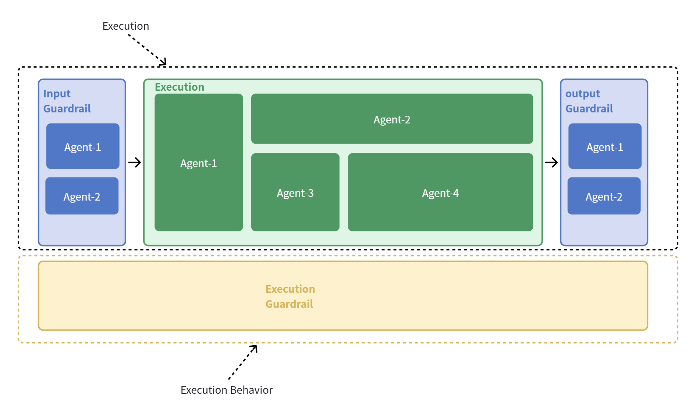
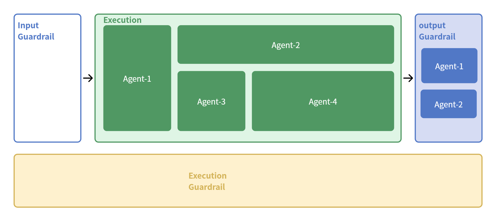

# System

## Overview

**System** is the highest-level abstraction in Odyssey.

A user-configured workflow does not exist independently. Instead, it runs within the execution boundary defined by a **System** unit.

Unlike traditional AI workflow builders, where every component is represented as nodes in a single execution graph, Odyssey separates:

- the stable system structure
- the dynamic execution logic

This separation allows Odyssey to provide a clear architectural boundary while preserving flexibility through agent collaboration patterns.

A System consists of two fundamental layers:

- **Execution**
- **Execution Behavior**

---

# Fixed Structure

## Execution

**Execution** represents the active process that drives the system state forward.

It defines how tasks are performed and how different agents collaborate to achieve a specific goal.

Execution is composed of multiple agents working together through predefined **Patterns**.

A Pattern defines the collaboration strategy between agents, including:

- task decomposition
- information exchange
- execution order
- agent coordination logic

(Pattern will be introduced in a dedicated chapter.)

In other words:

> Execution defines the capability of the system to act.

---

## Execution Behavior

**Execution Behavior** represents the constraints and policies that govern the execution process.

Unlike Execution, it does not actively advance the system state. Instead, it observes, restricts, or modifies execution conditions.

Examples include:

- execution constraints
- permission control
- resource limitations
- runtime policies
- behavioral monitoring

Execution Behavior acts as a **cross-cutting layer** across the entire system lifecycle.

In other words:

> Execution Behavior defines the conditions under which the system acts.

---

# Guardrail Separation

Traditional AI systems usually group different safety mechanisms under the unified concept of **Guardrail**.

These mechanisms often include:

- input validation
- output validation
- tool safety checks
- runtime restrictions

However, Odyssey introduces a clearer separation.

## Input / Output Guardrail

Input and Output Guardrails are separated from Execution Behavior because they directly participate in system interaction.

They influence the transition of system states:

### Input Guardrail

Input Guardrail determines:

- whether a user request can enter the system
- how the request should be interpreted
- whether additional processing is required before execution

### Output Guardrail

Output Guardrail determines:

- whether generated results can be delivered
- whether results require modification or filtering
- how final responses should be presented

Therefore, Input and Output Guardrails actively participate in the interaction flow.

---

## Execution Behavior vs Guardrail

Odyssey distinguishes between:

| Component | Responsibility |
| --- | --- |
| Input / Output Guardrail | Control interaction-level state transitions |
| Execution Behavior | Define execution-level constraints and policies |

This separation creates a clearer mental model of how an AI system operates.

---

# Spatial Configuration

Odyssey represents System configuration as a **fixed 2D spatial layout**.

The spatial structure itself remains stable.

Users configure individual slots by adding components, while unconfigured capabilities remain as empty slots.

---

## System Overview

Existing AI building platforms often separate:

- workflow configuration
- guardrail configuration
- tool configuration
- agent settings

into different pages or panels.

As a result, users need to mentally reconstruct:

- which components have been configured
- where each component exists
- how different configurations relate to each other

Odyssey replaces this hidden configuration state with a visible spatial representation.

The 2D layout allows users to immediately understand:

- what has been configured
- what remains empty
- how the entire system is structured

---

## Complexity Isolation

A fixed System structure intentionally limits system-level complexity.

Instead of allowing unlimited composition at the System layer, Odyssey moves complexity into **Patterns**, where agent collaboration happens.

This creates a clear separation between different abstraction levels:

| Layer | Responsibility |
| --- | --- |
| System | Define the stable execution environment |
| Pattern | Define dynamic agent collaboration |
| Agent | Perform specialized reasoning or actions |

The System provides the foundation, while Patterns provide flexibility.

---

# Design Principle

Odyssey follows the principle:

> Keep the system structure stable; move complexity into composable patterns.

A stable System makes complex AI applications:

- easier to understand
- easier to debug
- easier to maintain

while Patterns preserve the flexibility required for advanced agent collaboration.

A System should describe:

> what kind of intelligence exists in the environment

while a Pattern should describe:

> how intelligence collaborates within that environment

---
